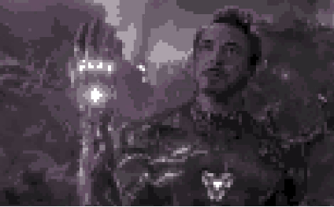

# Pixelate

Convert your iamges into pixel art

### original

### edited
 

## Getting Started

Capture an image from your camera or pick one from gallery, adjust pixel settings, remap colors and adjust color palette, rest will be handled by the app ;)
